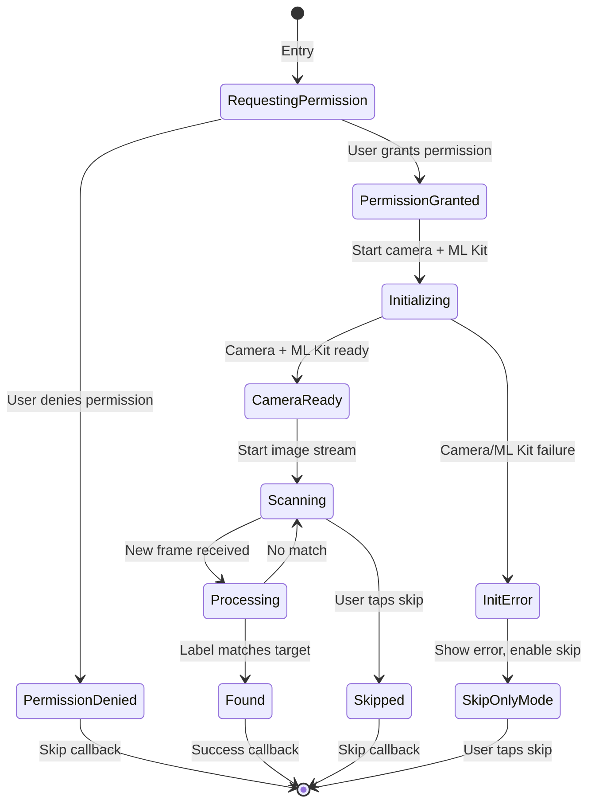

# AR Game Lesson Step - Design

## Architecture Overview

The AR Game step follows Clean Architecture with clear separation:

```
┌─────────────────────────────────────────────────────────────────┐
│ PRESENTATION LAYER                                              │
│  ├── ARGameController (camera, ML Kit, game state)             │
│  ├── ARGameBinding (dependency injection)                       │
│  ├── ARGamePage (orchestrates flow)                             │
│  └── Widgets                                                    │
│       ├── CameraPreviewWidget                                   │
│       ├── TargetDisplayWidget                                   │
│       ├── DebugOverlayWidget                                    │
│       └── SuccessDialogWidget                                   │
├─────────────────────────────────────────────────────────────────┤
│ DOMAIN LAYER                                                    │
│  ├── ProcessImageLabelUseCase (fuzzy matching logic)           │
│  └── Uses existing: UpdateLessonProgressUseCase                │
├─────────────────────────────────────────────────────────────────┤
│ DATA LAYER                                                      │
│  └── Uses existing: LearningRepository, VocabularyEntity,       │
│      LearningLocalDataSource                                    │
└─────────────────────────────────────────────────────────────────┘
```

## Component Design

### 1. ARGameController

**Responsibilities:**
- Request camera permission using `PermissionUtil` from `exo_shared`
- Initialize camera (back camera only) after permission granted
- Initialize ML Kit ImageLabeler
- Process camera image stream
- Detect matching labels using fuzzy matching
- Manage game state (scanning, processing, found)
- Handle success flow

**State:**
```dart
class ARGameController extends BaseController {
  // Camera
  CameraController? cameraController;
  ImageLabeler? imageLabeler;
  
  // Game state
  final RxList<ImageLabel> detectedLabels = <ImageLabel>[].obs;
  final RxBool isProcessing = false.obs;
  final RxBool objectFound = false.obs;
  final RxBool showDebugOverlay = true.obs;
  
  // Target vocabulary (passed via arguments)
  late final VocabularyEntity targetVocabulary;
  late final String lessonId;
}
```

### 2. ProcessImageLabelUseCase

**Input:** `VocabularyEntity` with `allowedLabels`, detected label string, confidence score

**Fuzzy Matching Logic:**
- Each vocabulary word has a list of `allowedLabels` (synonyms/related terms)
- A detection is successful when:
  1. `confidence >= 0.7` (70% confidence threshold)
  2. `detectedLabel` matches any item in `allowedLabels` (case-insensitive)

```dart
class ProcessImageLabelUseCase {
  /// Check if detected label matches the target vocabulary
  /// Returns true if confidence > 0.7 and label is in allowed list
  bool call({
    required VocabularyEntity vocabulary,
    required String detectedLabel,
    required double confidence,
  }) {
    if (confidence < 0.7) return false;
    
    return vocabulary.allowedLabels.any(
      (allowed) => allowed.toLowerCase() == detectedLabel.toLowerCase(),
    );
  }
}
```

### 3. VocabularyEntity Extension

Add `allowedLabels` field to `VocabularyEntity` for AR matching:

```dart
class VocabularyEntity {
  final String id;
  final String word;
  final String meaning;
  final String imagePath;
  final String? audioPath;
  final List<String> allowedLabels; // NEW: for AR matching
  
  // ... existing methods updated
}
```

## Vocabulary Allowed Labels Mapping

| Vocabulary ID | Word   | Allowed Labels |
|---------------|--------|----------------|
| vocab_a       | Apple  | Apple, Fruit, Food, Red, Natural foods |
| vocab_b       | Bottle | Bottle, Water bottle, Drinkware, Plastic, Container |
| vocab_c       | Cup    | Cup, Mug, Coffee cup, Tableware, Drinkware |
| vocab_d       | Desk   | Desk, Table, Furniture, Office, Wood |
| vocab_e       | Egg    | Egg, Food, Oval, White, Ingredient, Breakfast |

## Navigation & Arguments

**Route:** `/ar-game`

**Navigation from Learning Flow:**
```dart
Get.toNamed(
  AppRoutes.arGame,
  arguments: {
    'vocabulary': vocabulary,  // VocabularyEntity
    'lessonId': lesson.id,     // String
  },
);
```

**Navigation from Home (Debug):**
```dart
// Test button with mock vocabulary
Get.toNamed(
  AppRoutes.arGame,
  arguments: {
    'vocabulary': VocabularyEntity(
      id: 'test_vocab',
      word: 'Apple',
      meaning: 'Quả Táo',
      imagePath: 'assets/images/apple.png',
      allowedLabels: ['Apple', 'Fruit', 'Food', 'Red'],
    ),
    'lessonId': 'test_lesson',
  },
);
```

## Game Flow



## UI Layout

```
┌────────────────────────────────────────┐
│ [Header: "Find a [WORD]!"]             │
│ ┌────────────────────────────────────┐ │
│ │                                    │ │
│ │     [Camera Preview]               │ │
│ │                                    │ │
│ │  ┌──────────────────────────────┐  │ │
│ │  │ Debug Overlay (top-left)     │  │ │
│ │  │ [Tap to toggle]              │  │ │
│ │  │ • Apple: 85%                 │  │ │
│ │  │ • Fruit: 72%                 │  │ │
│ │  └──────────────────────────────┘  │ │
│ │                                    │ │
│ └────────────────────────────────────┘ │
│                                        │
│ [Skip Button]                          │
└────────────────────────────────────────┘
```

## Error Handling

| Error | Handling |
|-------|----------|
| Camera permission denied | Show permission request dialog, allow skip if rejected |
| Camera initialization failed | Show error message, enable skip-only mode |
| ML Kit initialization failed | Show error message, enable skip-only mode |
| Low memory | Reduce image processing frequency to 1000ms |
| Image processing exception | Log error, continue to next frame |

## Performance Considerations

1. **Frame Throttling**: Process 1 frame every 500ms to reduce CPU load
2. **Memory Management**: Dispose camera and labeler on `onClose()`
3. **Resolution**: Use `ResolutionPreset.medium` (not high)
4. **Offline Mode**: ML Kit runs fully offline, no network needed
5. **Skip Processing**: Skip frame if previous frame still processing (`isProcessing`)
