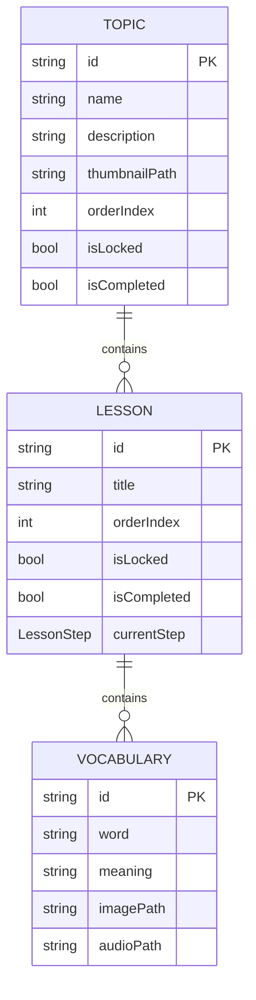
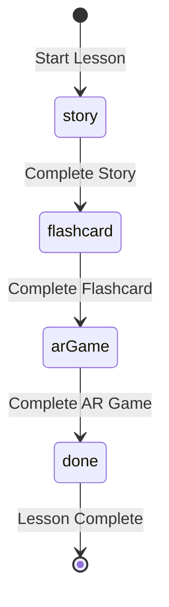

# Design: Prepare Learning Feature

## Overview

This design documents the architectural decisions for the Learning Feature's Domain and Data layers.

---

## Data Model Architecture

### Entity Hierarchy



### LessonStep Enum



#### Serialization Pattern

| Enum Value | Serialized ID (`toIdString`) |
|------------|------------------------------|
| `story`    | `lesson_step_story`          |
| `flashcard`| `lesson_step_flashcard`      |
| `arGame`   | `lesson_step_ar_game`        |
| `done`      | `lesson_step_done`           |

---

## Unlocking Logic

### Topic Unlocking

- Topic with `orderIndex: 0` is always unlocked
- Topic with `orderIndex: n` is unlocked when Topic `n-1` has `isCompleted = true`

### Lesson Unlocking

- Lesson with `orderIndex: 0` within a Topic is always unlocked
- Lesson with `orderIndex: n` is unlocked when Lesson `n-1` in the same Topic has `isCompleted = true`

### Step Progression

| Current Step | On Completion | Next Step | Side Effect |
|--------------|---------------|-----------|-------------|
| `story` | User finishes story | `flashcard` | None |
| `flashcard` | User finishes flashcard | `arGame` | None |
| `arGame` | User finishes AR game | `done` | `isCompleted = true`, unlock next Lesson |

---

## Isar Relationships

### Using IsarLinks & Backlinks

Isar uses `IsarLinks<T>` for one-to-many relationships and `@Backlink` for the inverse:

```dart
@collection
class TopicModel {
  Id id = Isar.autoIncrement;
  String modelId; // e.g. topic_alphabet
  
  // One Topic has many Lessons
  @Index()
  final lessons = IsarLinks<LessonModel>();
}

@collection
class LessonModel {
  Id id = Isar.autoIncrement;
  String modelId; // e.g. lesson_a
  
  // One Lesson has many Vocabularies
  @Index()
  final vocabularies = IsarLinks<VocabularyModel>();
  
  // Backlink to parent Topic
  @Backlink(to: 'lessons')
  final topic = IsarLink<TopicModel>();
}

@collection
class VocabularyModel {
  Id id = Isar.autoIncrement;
  String modelId; // e.g. vocab_apple
  
  // Backlink to parent Lesson
  @Backlink(to: 'vocabularies')
  final lesson = IsarLink<LessonModel>();
}
```

### Loading Relationships

When loading entities, relationships must be explicitly loaded:

```dart
Future<TopicEntity> getTopicWithLessons(String topicId) async {
  final topic = await _isar.topicModels
      .filter()
      .modelIdEqualTo(topicId)
      .findFirst();
  
  if (topic != null) {
    // Explicitly load the links
    await topic.lessons.load();
    
    for (final lesson in topic.lessons) {
      await lesson.vocabularies.load();
    }
  }
  
  return topic?.toEntity();
}
```

---

## Seed Data Structure

### Alphabet Topic

| Topic | Lessons |
|-------|---------|
| Alphabet (order: 0) | Letter A, B, C, D, E |

### Vocabulary per Lesson

| Lesson | Word | Meaning (VI) | Image Asset |
|--------|------|--------------|-------------|
| Letter A | Apple | Quả táo | `Assets.images.apple.path` |
| Letter B | Bottle | Cái chai | `Assets.images.bottle.path` |
| Letter C | Cup | Cái cốc | `Assets.images.cup.path` |
| Letter D | Desk | Cái bàn | `Assets.images.desk.path` |
| Letter E | Egg | Quả trứng | `Assets.images.egg.path` |

---

## Error Handling Strategy

### Custom Errors

Use errors from `core/exceptions/`:

```dart
// For database operations
throw StorageError('Failed to save topic', originalError);

// For missing entities
throw NotFoundError('Lesson not found: $lessonId');
```

---

## File Structure

```
lib/features/learning/
├── data/
│   ├── datasources/
│   │   └── learning_local_datasource.dart
│   ├── mappers/
│   │   └── learning_mapper.dart
│   ├── models/
│   │   ├── topic_model.dart
│   │   ├── lesson_model.dart
│   │   └── vocabulary_model.dart
│   └── repositories/
│       └── learning_repository.dart
│
└── domain/
    ├── entities/
    │   ├── lesson_step_type.dart
    │   ├── topic_entity.dart
    │   ├── lesson_entity.dart
    │   └── vocabulary_entity.dart
    ├── repositories/
    │   └── learning_repository_interface.dart
    └── usecases/
        ├── get_topics_usecase.dart
        ├── get_topic_by_id_usecase.dart
        ├── get_lesson_by_id_usecase.dart
        ├── update_lesson_progress_usecase.dart
        └── seed_initial_data_usecase.dart
```
